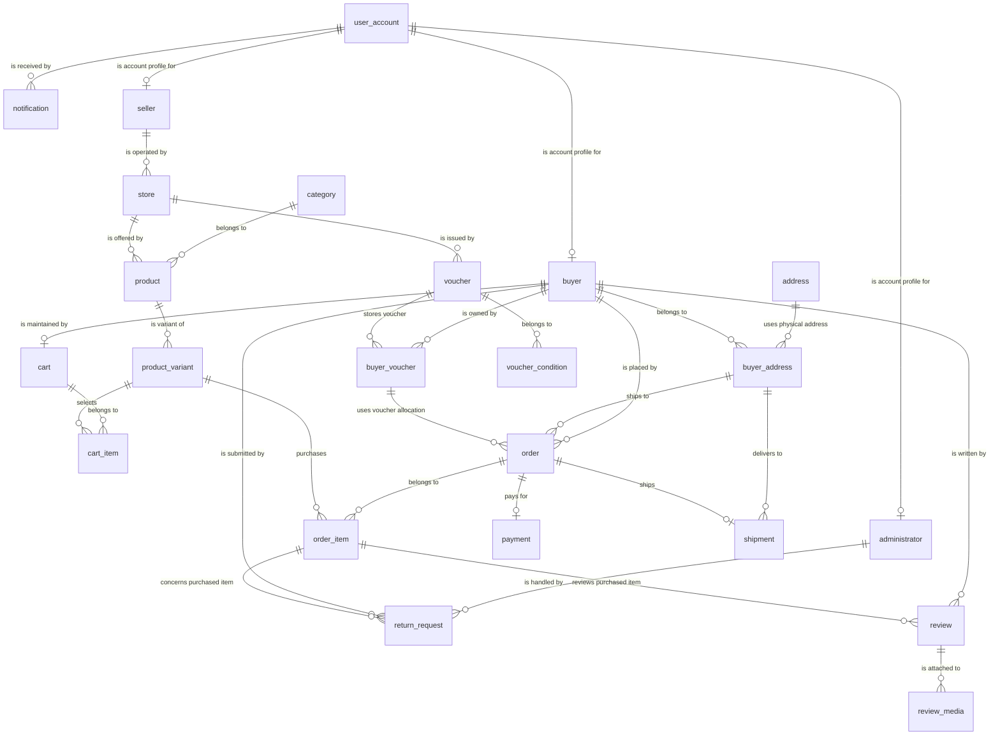

# Relational Mapping

Generated from the live `marketplace_eerd` MySQL schema. This is written in a DrawSQL-style table/relationship format so it can be used beside the EERD when explaining the relational schema.

Note: `` `order` `` is quoted in SQL because `ORDER` is a MySQL keyword. `cart.total_items` is a stored derived/cache column maintained by triggers from `cart_item`.

## Schema Overview

| Table | Primary Key | Main Role |
|---|---|---|
| `address` | `address_id` | Physical address |
| `administrator` | `account_id` | Administrator subtype profile |
| `buyer` | `account_id` | Buyer subtype profile |
| `buyer_address` | `buyer_address_id` | Buyer-specific recipient profile for an address |
| `buyer_voucher` | `buyer_voucher_id` | Buyer ownership and usage count of a voucher |
| `cart` | `cart_id` | One active cart per buyer, with cached total item quantity |
| `cart_item` | `cart_id`, `variant_id` | Variant lines selected in a cart |
| `category` | `category_id` | Product classification |
| `notification` | `notification_id` | Notifications received by accounts |
| `order` | `order_id` | Buyer order header |
| `order_item` | `order_id`, `variant_id` | Purchased variant lines in an order |
| `payment` | `payment_id` | Payment record for an order |
| `product` | `product_id` | Store-level product listing |
| `product_variant` | `variant_id` | Sellable product option with price and stock |
| `return_request` | `request_id` | Buyer return/refund request for an order item |
| `review` | `review_id` | Buyer review of a purchased order item |
| `review_media` | `review_id`, `media_url` | Media attached to a review |
| `seller` | `account_id` | Seller subtype profile |
| `shipment` | `shipment_id` | Shipment record for an order |
| `store` | `store_id` | Seller-operated marketplace stores |
| `user_account` | `account_id` | Supertype account table for buyers, sellers, and administrators |
| `voucher` | `voucher_code` | Store voucher definition |
| `voucher_condition` | `condition_id` | Rules attached to a voucher |

## Tables

### `address`

| Column | Type | Key | Null | Notes |
|---|---|---|---|---|
| `address_id` | bigint | PK | NO | auto_increment |
| `street` | varchar(180) |  | NO |  |
| `ward` | varchar(120) |  | YES |  |
| `district` | varchar(120) |  | YES |  |
| `city` | varchar(120) |  | NO |  |
| `country` | varchar(120) |  | NO |  |

### `administrator`

| Column | Type | Key | Null | Notes |
|---|---|---|---|---|
| `account_id` | bigint | PK FK -> `user_account.account_id` | NO |  |
| `employee_id` | varchar(60) |  | NO |  |
| `staff_name` | varchar(160) |  | NO |  |
| `management_role` | varchar(80) |  | YES |  |
| `working_status` | enum('working','on_leave','inactive','terminated') |  | NO |  |

### `buyer`

| Column | Type | Key | Null | Notes |
|---|---|---|---|---|
| `account_id` | bigint | PK FK -> `user_account.account_id` | NO |  |
| `first_name` | varchar(80) |  | NO |  |
| `last_name` | varchar(80) |  | NO |  |
| `date_of_birth` | date |  | YES |  |
| `gender` | enum('male','female','other','prefer_not_to_say') |  | YES |  |

### `buyer_address`

| Column | Type | Key | Null | Notes |
|---|---|---|---|---|
| `buyer_address_id` | bigint | PK | NO | auto_increment |
| `buyer_id` | bigint | FK -> `buyer.account_id` UQ: uq_buyer_address_recipient | NO |  |
| `address_id` | bigint | FK -> `address.address_id` UQ: uq_buyer_address_recipient | NO |  |
| `recipient_name` | varchar(160) | UQ: uq_buyer_address_recipient | NO |  |
| `recipient_phone` | varchar(30) | UQ: uq_buyer_address_recipient | NO |  |
| `is_default` | tinyint(1) |  | NO | default 0 |
| `default_buyer_id` | bigint | UQ: uq_buyer_default_address | YES | STORED GENERATED |

### `buyer_voucher`

| Column | Type | Key | Null | Notes |
|---|---|---|---|---|
| `buyer_voucher_id` | bigint | PK | NO | auto_increment |
| `buyer_id` | bigint | FK -> `buyer.account_id` UQ: uq_buyer_voucher | NO |  |
| `voucher_code` | varchar(60) | FK -> `voucher.voucher_code` UQ: uq_buyer_voucher | NO |  |
| `amount` | int |  | NO | default 1 |
| `usage_count` | int |  | NO | default 0 |

### `cart`

| Column | Type | Key | Null | Notes |
|---|---|---|---|---|
| `cart_id` | bigint | PK | NO | auto_increment |
| `buyer_id` | bigint | FK -> `buyer.account_id` UQ: buyer_id | NO |  |
| `total_items` | int |  | NO | default 0 Derived: SUM(cart_item.quantity) - duoc trigger tu cap nhat |

### `cart_item`

| Column | Type | Key | Null | Notes |
|---|---|---|---|---|
| `cart_id` | bigint | PK FK -> `cart.cart_id` | NO |  |
| `variant_id` | bigint | PK FK -> `product_variant.variant_id` | NO |  |
| `quantity` | int |  | NO |  |
| `unit_price` | decimal(12,2) |  | NO |  |
| `time_added` | datetime |  | NO |  |

### `category`

| Column | Type | Key | Null | Notes |
|---|---|---|---|---|
| `category_id` | bigint | PK | NO | auto_increment |
| `category_name` | varchar(120) | UQ: category_name | NO |  |
| `description` | text |  | YES |  |

### `notification`

| Column | Type | Key | Null | Notes |
|---|---|---|---|---|
| `notification_id` | bigint | PK | NO | auto_increment |
| `account_id` | bigint | FK -> `user_account.account_id` | NO |  |
| `title` | varchar(160) |  | NO |  |
| `content` | text |  | NO |  |
| `type` | enum('order','voucher','shipment','payment','return','system','promotion') |  | NO |  |
| `timestamp` | datetime |  | NO |  |
| `status` | enum('read','unread','archived') |  | NO |  |

### `order`

| Column | Type | Key | Null | Notes |
|---|---|---|---|---|
| `order_id` | bigint | PK | NO | auto_increment |
| `buyer_id` | bigint | FK -> `buyer.account_id` | NO |  |
| `buyer_address_id` | bigint | FK -> `buyer_address.buyer_address_id` | NO |  |
| `buyer_voucher_id` | bigint | FK -> `buyer_voucher.buyer_voucher_id` | YES |  |
| `order_date` | datetime |  | NO |  |
| `order_status` | enum('pending','paid','processing','shipped','delivered','cancelled','return_requested') |  | NO |  |

### `order_item`

| Column | Type | Key | Null | Notes |
|---|---|---|---|---|
| `order_id` | bigint | PK FK -> `order.order_id` | NO |  |
| `variant_id` | bigint | PK FK -> `product_variant.variant_id` | NO |  |
| `quantity` | int |  | NO |  |
| `unit_price` | decimal(12,2) |  | NO |  |

### `payment`

| Column | Type | Key | Null | Notes |
|---|---|---|---|---|
| `payment_id` | bigint | PK | NO | auto_increment |
| `order_id` | bigint | FK -> `order.order_id` UQ: order_id | NO |  |
| `payment_method` | enum('e_wallet','credit_card','bank_transfer','cash_on_delivery') |  | NO |  |
| `payment_time` | datetime |  | NO |  |
| `payment_status` | enum('pending','paid','failed','refunded','cancelled') |  | NO |  |
| `paid_amount` | decimal(12,2) |  | NO |  |

### `product`

| Column | Type | Key | Null | Notes |
|---|---|---|---|---|
| `product_id` | bigint | PK | NO | auto_increment |
| `store_id` | bigint | FK -> `store.store_id` | NO |  |
| `category_id` | bigint | FK -> `category.category_id` | NO |  |
| `product_name` | varchar(180) |  | NO |  |
| `description` | text |  | YES |  |
| `creation_time` | datetime |  | NO |  |

### `product_variant`

| Column | Type | Key | Null | Notes |
|---|---|---|---|---|
| `variant_id` | bigint | PK | NO | auto_increment |
| `product_id` | bigint | FK -> `product.product_id` UQ: uq_product_variant_option | NO |  |
| `option_value` | varchar(160) | UQ: uq_product_variant_option | NO |  |
| `price` | decimal(12,2) |  | NO |  |
| `status` | enum('active','available','out_of_stock','discontinued') |  | NO |  |
| `stock_quantity` | int |  | NO |  |
| `creation_time` | datetime |  | NO |  |

### `return_request`

| Column | Type | Key | Null | Notes |
|---|---|---|---|---|
| `request_id` | bigint | PK | NO | auto_increment |
| `buyer_id` | bigint | FK -> `buyer.account_id` | NO |  |
| `admin_id` | bigint | FK -> `administrator.account_id` | YES |  |
| `order_id` | bigint | FK -> `order_item.order_id` | NO |  |
| `variant_id` | bigint | FK -> `order_item.variant_id` | NO |  |
| `request_date` | date |  | NO |  |
| `reason` | text |  | NO |  |
| `request_status` | enum('pending','reviewing','approved','rejected','closed') |  | NO |  |
| `requested_refund_amount` | decimal(12,2) |  | NO |  |
| `handling_result` | text |  | YES |  |

### `review`

| Column | Type | Key | Null | Notes |
|---|---|---|---|---|
| `review_id` | bigint | PK | NO | auto_increment |
| `buyer_id` | bigint | FK -> `buyer.account_id` UQ: uq_buyer_order_variant_review | NO |  |
| `order_id` | bigint | FK -> `order_item.order_id` UQ: uq_buyer_order_variant_review | NO |  |
| `variant_id` | bigint | FK -> `order_item.variant_id` UQ: uq_buyer_order_variant_review | NO |  |
| `content` | text |  | NO |  |
| `rating_score` | int |  | NO |  |
| `review_date` | date |  | NO |  |

### `review_media`

| Column | Type | Key | Null | Notes |
|---|---|---|---|---|
| `review_id` | bigint | PK FK -> `review.review_id` | NO |  |
| `media_url` | varchar(500) | PK | NO |  |

### `seller`

| Column | Type | Key | Null | Notes |
|---|---|---|---|---|
| `account_id` | bigint | PK FK -> `user_account.account_id` | NO |  |
| `tax_id` | varchar(60) | UQ: tax_id | NO |  |
| `business_type` | varchar(80) |  | YES |  |
| `owner_name` | varchar(160) |  | YES |  |
| `verification_status` | enum('pending','verified','rejected','suspended') |  | NO |  |
| `product_management` | text |  | YES |  |

### `shipment`

| Column | Type | Key | Null | Notes |
|---|---|---|---|---|
| `shipment_id` | bigint | PK | NO | auto_increment |
| `order_id` | bigint | FK -> `order.order_id` UQ: order_id | NO |  |
| `buyer_address_id` | bigint | FK -> `buyer_address.buyer_address_id` | NO |  |
| `tracking_code` | varchar(80) | UQ: tracking_code | NO |  |
| `shipping_method` | enum('standard','express','same_day','pickup') |  | NO |  |
| `shipping_status` | enum('processing','in_transit','delivered','failed','returned','cancelled') |  | NO |  |
| `estimated_delivery_date` | date |  | YES |  |
| `actual_delivery_date` | date |  | YES |  |

### `store`

| Column | Type | Key | Null | Notes |
|---|---|---|---|---|
| `store_id` | bigint | PK | NO | auto_increment |
| `seller_id` | bigint | FK -> `seller.account_id` | NO |  |
| `store_name` | varchar(160) |  | NO |  |
| `description` | text |  | YES |  |
| `creation_date` | datetime |  | NO |  |
| `phone_number` | varchar(30) |  | YES |  |

### `user_account`

| Column | Type | Key | Null | Notes |
|---|---|---|---|---|
| `account_id` | bigint | PK | NO | auto_increment |
| `username` | varchar(80) | UQ: username | NO |  |
| `password_hash` | varchar(255) |  | NO |  |
| `email` | varchar(255) | UQ: email | NO |  |
| `phone_number` | varchar(30) |  | YES |  |
| `creation_date` | datetime |  | NO |  |
| `account_status` | enum('active','inactive','suspended','locked','pending') |  | NO |  |
| `account_type` | enum('buyer','seller','administrator') |  | NO |  |

### `voucher`

| Column | Type | Key | Null | Notes |
|---|---|---|---|---|
| `voucher_code` | varchar(60) | PK | NO |  |
| `store_id` | bigint | FK -> `store.store_id` | NO |  |
| `discount_type` | enum('percentage','fixed_amount') |  | NO |  |
| `discount_value` | decimal(12,2) |  | NO |  |
| `global_usage_limit` | int |  | YES |  |
| `applicable_conditions` | text |  | YES |  |
| `start_date` | date |  | NO |  |
| `end_date` | date |  | NO |  |

### `voucher_condition`

| Column | Type | Key | Null | Notes |
|---|---|---|---|---|
| `condition_id` | bigint | PK | NO | auto_increment |
| `voucher_code` | varchar(60) | FK -> `voucher.voucher_code` | NO |  |
| `condition_type` | enum('minimum_order_amount','category_id') |  | NO |  |
| `operator` | enum('=','>','>=','<','<=','!=') |  | NO |  |
| `value` | varchar(120) |  | NO |  |

## Relationships

| Child Table | Relationship | Parent Table | FK Columns | Referenced Columns | Cardinality |
|---|---|---|---|---|---|
| `administrator` | is account profile for | `user_account` | `account_id` | `account_id` | 1 parent : 0..1 child |
| `buyer` | is account profile for | `user_account` | `account_id` | `account_id` | 1 parent : 0..1 child |
| `buyer_address` | uses physical address | `address` | `address_id` | `address_id` | 1 parent : 0..N children |
| `buyer_address` | belongs to | `buyer` | `buyer_id` | `account_id` | 1 parent : 0..N children |
| `buyer_voucher` | is owned by | `buyer` | `buyer_id` | `account_id` | 1 parent : 0..N children |
| `buyer_voucher` | stores voucher | `voucher` | `voucher_code` | `voucher_code` | 1 parent : 0..N children |
| `cart` | is maintained by | `buyer` | `buyer_id` | `account_id` | 1 parent : 0..1 child |
| `cart_item` | belongs to | `cart` | `cart_id` | `cart_id` | 1 parent : 0..N children |
| `cart_item` | selects | `product_variant` | `variant_id` | `variant_id` | 1 parent : 0..N children |
| `notification` | is received by | `user_account` | `account_id` | `account_id` | 1 parent : 0..N children |
| `order` | is placed by | `buyer` | `buyer_id` | `account_id` | 1 parent : 0..N children |
| `order` | ships to | `buyer_address` | `buyer_address_id` | `buyer_address_id` | 1 parent : 0..N children |
| `order` | uses voucher allocation | `buyer_voucher` | `buyer_voucher_id` | `buyer_voucher_id` | 1 parent : 0..N children |
| `order_item` | belongs to | `order` | `order_id` | `order_id` | 1 parent : 0..N children |
| `order_item` | purchases | `product_variant` | `variant_id` | `variant_id` | 1 parent : 0..N children |
| `payment` | pays for | `order` | `order_id` | `order_id` | 1 parent : 0..1 child |
| `product` | belongs to | `category` | `category_id` | `category_id` | 1 parent : 0..N children |
| `product` | is offered by | `store` | `store_id` | `store_id` | 1 parent : 0..N children |
| `product_variant` | is variant of | `product` | `product_id` | `product_id` | 1 parent : 0..N children |
| `return_request` | is handled by | `administrator` | `admin_id` | `account_id` | 1 parent : 0..N children |
| `return_request` | is submitted by | `buyer` | `buyer_id` | `account_id` | 1 parent : 0..N children |
| `return_request` | concerns purchased item | `order_item` | `order_id`, `variant_id` | `order_id`, `variant_id` | 1 parent : 0..N children |
| `review` | is written by | `buyer` | `buyer_id` | `account_id` | 1 parent : 0..N children |
| `review` | reviews purchased item | `order_item` | `order_id`, `variant_id` | `order_id`, `variant_id` | 1 parent : 0..N children |
| `review_media` | is attached to | `review` | `review_id` | `review_id` | 1 parent : 0..N children |
| `seller` | is account profile for | `user_account` | `account_id` | `account_id` | 1 parent : 0..1 child |
| `shipment` | delivers to | `buyer_address` | `buyer_address_id` | `buyer_address_id` | 1 parent : 0..N children |
| `shipment` | ships | `order` | `order_id` | `order_id` | 1 parent : 0..1 child |
| `store` | is operated by | `seller` | `seller_id` | `account_id` | 1 parent : 0..N children |
| `voucher` | is issued by | `store` | `store_id` | `store_id` | 1 parent : 0..N children |
| `voucher_condition` | belongs to | `voucher` | `voucher_code` | `voucher_code` | 1 parent : 0..N children |

## Mermaid ER Diagram

## Trigger Notes

| Trigger | Timing | Table | Purpose |
|---|---|---|---|
| `trg_cartitem_after_delete` | AFTER DELETE | `cart_item` | Recalculates cart.total_items after a cart line is deleted |
| `trg_cartitem_after_insert` | AFTER INSERT | `cart_item` | Recalculates cart.total_items after a cart line is inserted |
| `trg_cartitem_after_update` | AFTER UPDATE | `cart_item` | Recalculates cart.total_items for old/new carts after a cart line changes |
| `trg_return_request_before_insert` | BEFORE INSERT | `return_request` | Rejects return requests when the related order has no delivered shipment |
